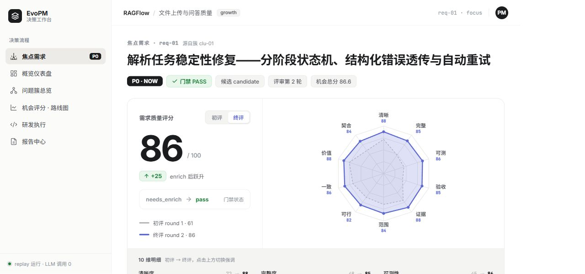
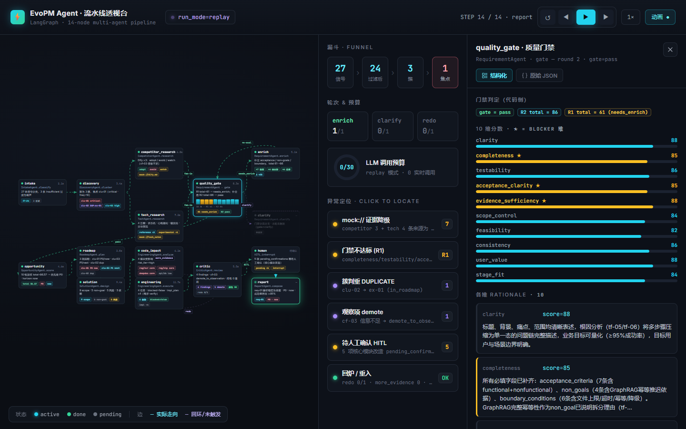

<div align="center">

# EvoPM Agent

**基于 LangGraph 的多智能体产品需求决策系统 · 黑客松 Demo**

把分散的用户反馈与 GitHub issues，经一条带「淘汰 / 分流出口」的需求漏斗，<br/>转化为**有证据支撑**的产品机会与研发执行建议。


<sub>↑ 前端「流水线透视台」：14 节点 LangGraph 多智能体流水线实时可视化（详见 <a href="#-前端可视化--流水线透视台">前端可视化</a>）</sub>

</div>

---

## 目录

- [项目介绍](#项目介绍)
- [核心设计原则](#核心设计原则)
- [前端可视化（两套界面）](#-前端可视化两套界面)
- [安装](#安装)
- [使用](#使用)
- [测试](#测试)
- [文档](#文档)

## 项目介绍

EvoPM Agent 是一个基于 LangGraph 的多智能体产品需求决策系统（黑客松 Demo）。它把分散的用户反馈与 GitHub issues 等多源信号，经过一条带「淘汰 / 分流出口」的需求漏斗，转化为有证据支撑的产品机会与研发执行建议：

```text
多源信号导入 → 可行动性过滤 → 聚类 → 历史需求查重 → 竞品/技术调研
→ 需求质量门禁 → 机会评分分流 → 研发执行建议 → 对抗式审查 → 分级人工介入 → 报告产出
```

技术栈：Python ≥ 3.11 · LangGraph · langchain-openai · Pydantic v2 · Typer/Rich · Jinja2。LLM 用智谱 GLM Coding Plan（OpenAI 兼容订阅端点 `…/api/coding/paas/v4/`），主链 `glm-5.1`，开发调试用轻量的 `glm-4.5-air`。

> 这是 Demo，不是产品级系统。设计取向：**演示路径可靠 > 工程完备**。不做鉴权、多租户、计费、生产写操作。详见 `CLAUDE.md` 与 `docs/`。

## 核心设计原则

- **人工介入分级**：低风险结论自动通过，中风险进待确认清单，高风险强制人工确认；系统只输出建议文档，**永不产出代码改动**。
- **需求漏斗有出口**：每一级过滤 / 查重 / 分流都有记录并在报告中展示。
- **证据闭包**：所有结论引用的 evidence id 都由代码校验必须指向真实上游对象，非法引用剔除并交对抗式审查。
- **稳定运行兜底**：LLM 指数退避重试、结构化输出校验重试、磁盘缓存 + `--replay` 离线重放、外部依赖失败自动降级 mock。

## 🖥 前端可视化（两套界面）

仓库内含两套独立前端（均 Vite + React + TS），对应两种受众：

### 决策工作台 · Decision Workbench（`frontend-product/`）

给产品经理 / 团队 / 评委看**结论**的成品界面——浅色 Linear 风、6 屏左导航切换、接真实 glm-5.1 replay 数据。



- **焦点需求 HERO**：10 维质量雷达 + 总分 **61 → 86** 滚动、初评/终评切换、可点击的**证据弹层**（原文摘录 + 来源 + 强度，`mock://` 标本地材料）、Linear 列表式折叠详情模块。
- **概览仪表盘**（决策漏斗 27→5→9→3→1）、**问题簇总览**（DUPLICATE 标记）、**机会评分 · 路线图**（Now/Next/Later）、**研发执行**（核心模块 ⚠ + 任务卡 + 风险）、**报告中心**（4 份精排阅读）。
- **浅色 Linear 风**：白底 + 发丝灰线，紫色仅留数据序列，绿色仅作 PASS / 跃升语义。

```bash
cd frontend-product && npm install && npm run dev   # http://localhost:5174
```

### 流水线透视台 · Pipeline Observatory（`frontend/`）

现场演示**多智能体执行过程**并定位问题——深色科技风、14 节点实时点亮，酷炫但过程清晰、字段明文可读。



- **14 节点蛇形 DAG**，接真实 glm-5.1 replay 数据：每个节点卡显示节点名 / agent / 一行结论 / 耗时 / 迷你指标（如 `quality_gate` 带 10 维分数条 R1 61 → R2 86）。
- **条件分支与回环明示**：竞品 / 技术调研并行 fan-in 门禁、`needs_enrich → 重评` 回环、`pass` 直通机会评分，以及 `clarify` / `redo` / `more_evidence` 未触发的 ghost 路径（紫虚线）。
- **播放模拟 + 计数侧栏 + 异常定位**：▶ / ⏸ / 单步 / 倍速、漏斗 / rounds / LLM 预算环，点击异常项定位并高亮节点。
- **节点检视抽屉**：点任意节点看结构化字段表，并可 **结构化 ↔ 原始 JSON** 切换。

```bash
cd frontend && npm install && npm run dev   # http://localhost:5173
```

> 两套均用静态 replay 数据，**尚未接后端实时数据**。完成度与目标接口见各自 README（[`frontend-product/README.md`](frontend-product/README.md) · [`frontend/README.md`](frontend/README.md)）。

## 安装

需要 Python ≥ 3.11，推荐用 [uv](https://docs.astral.sh/uv/) 管理依赖。

```bash
# 1. 克隆
git clone https://github.com/Adversit/Product-Evolution-Agents.git
cd Product-Evolution-Agents

# 2. 安装依赖（含开发依赖 pytest）
uv sync --extra dev          # 仅运行可省略 --extra dev

# 3. 配置密钥
cp .env.example .env         # 填入 ZHIPUAI_API_KEY（GITHUB_TOKEN 可选）
```

`.env` 永远不入库。`runs/`（报告输出、state dump、LLM 缓存）同样不入库。

## 使用

全链已实现：14 节点的 LangGraph 编排（信号导入 → 过滤聚类 → 竞品/技术调研 → 质量门禁 → 机会评分 → 执行建议 → 对抗审查 → 分级人工介入 → 报告），含 3 个人工确认断点与 mock/replay 降级兜底。

```bash
# 运行测试（规则单测 + 证据闭包 + 降级 + 渲染 + graph 冒烟）
pytest tests/

evopm run --mock                 # mock 模式：跳过 GitHub API 与 web_search，全用本地材料
evopm run --replay               # 离线重放：LLM 全走缓存（断网演示兜底）
evopm run                        # live 模式：真实 GitHub API + web_search
evopm run --model glm-4.5-air  # 指定开发期轻量模型
evopm run --data data/demo_kb    # 指定数据目录
evopm init                       # 交互式问答生成 data/<name>/product.yaml
```

> **运行真实链路需要 `ZHIPUAI_API_KEY`**（`--mock` 也要，只是跳过 GitHub/web_search）。无 key 时 `pytest tests/` 仍全绿——需要真实 LLM 的 fixture 会自动 skip。

开发与测试遵循 **先 mock 跑通、再接真实 API** 的顺序：先用 `data/demo_kb/` 的本地 mock 数据 + `--mock` + `glm-4.5-air` 跑通全链，稳定后再逐项接真实 GitHub API → web_search → `glm-5.1`。

## 测试

```bash
pytest tests/        # 本机若禁访问全局 temp，可加 --basetemp=runs/_pytmp
```

无 key 时：规则、证据闭包、LLM 重试/缓存/预算、调研降级、报告渲染、HITL 解析、graph 编译与 `test_loop_caps`/`test_degrade` 均通过；需要真实 LLM 的 agent fixture 与 `test_replay_e2e` 自动 skip，放入 key 后即可解封运行。

## 文档

开发以 `docs/` 下四份文档为准（优先级从上到下）：`spec.md`（技术合同：schema/State/Agent 契约/规则/执行边界）、`tasks.md`（任务卡）、`plan.md`（分支划分与集成顺序）、`EvoPM_Demo_MVP_PRD_V1.0.md`（需求范围）。前端需求与接口契约见 `docs/frontend_*.md`、`docs/claude_design/`。
